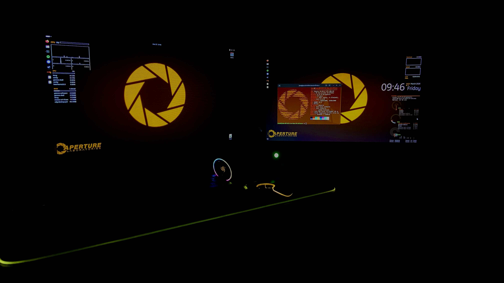
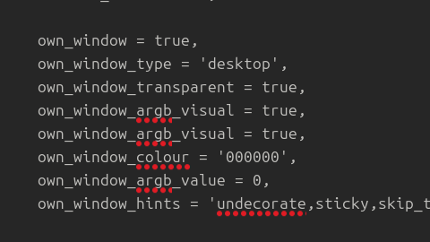
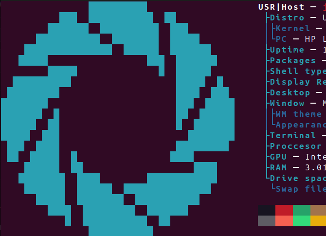
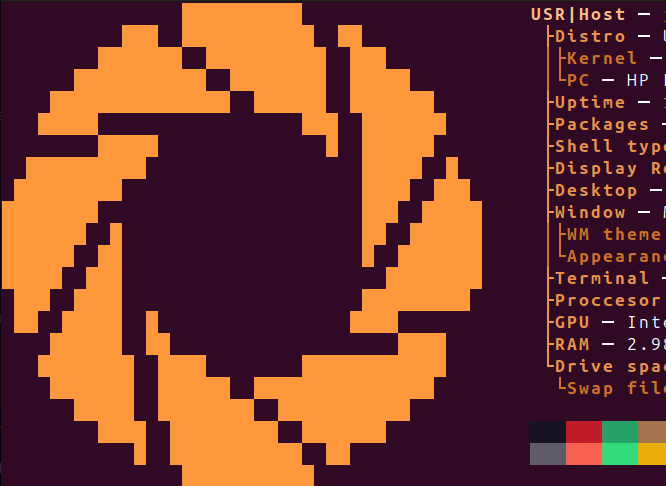

**DISCLAIMER**

This is meant to be a "fix" of Erlice's aperture os repository (hence the apertureosnew name) because it was last updated 8 years ago and also uses neofetch so that's not very "up to date" if you ask me. They've also been offline for 5 years as im writing this, so i do not expect them to update it. Anyways, credits to [Erlice](https://github.com/Erlite) for the desktop background! Wherever they are...

**Keep in mind that if you want to rice this as Erlice did, you should probably use the files in their repository, shown [here](https://github.com/Erlite/apertureos)**

**Info**

tiny repository to make your pc look like this! 


DE: Gnome

WM theme (only relevant if youre also on ubuntu) Yaru Dark

Distro: Ubuntu 24.04.4

**Prerequisites**

Recommended if you use ubuntu: use the orange or blue theme in ubuntu so that the files on the desktop have an orange/blue subcolor, adding to the vibe

Have atleast one braincell to know where stuff is (although, to be fair, if youre visiting this to customize fastfetch, you're probably missing a couple.)

**Step 1: Install Conky and Conky Manager 2**

RUN:

``` sudo apt update ``` AND ```sudo apt install conky-all``` (if you get an error you should probably set up the repository for it, but most distros come with the repository on it anyway)

Then for installing Conky Manager 2:

Add repository: ```sudo add-apt-repository ppa:teejee2008/foss```

Then run: ```sudo apt update``` AND ```sudo apt install conky-manager2```

████████████████████████████████████████████

after doing all this you have to set up the windows to match mine. Im using conky seamod, gotham, the 4 core cpu panel, and the network + process panel. The network, gotham, and conky seamod widgets are on the second screen, and the 4 core cpu panel + process panel on the other screen.

****Note**

Some things are not going to work as expected, like seamod. You have to edit these manually, because the transparency breaks (for some reason) Either use **nano** to set the **own_window_type** to **desktop** or a file editor.



**Step 2: Desktop and fastfetch**

Desktop bg is easy, just download the wallpaper.png and set it as your background. If you have another background, skip this part.

****Fastfetch**

Install fastfetch:

Repository: ```sudo add-apt-repository ppa:zhangsongcui3371/fastfetch```

Then run ```sudo apt update``` AND ```sudo apt install fastfetch``` Fastfetch should now be installed.

████████████████████████████████████████████

****Configure fastfetch:**

Download the **aperture.txt** ascii art which is the aperture science ascii art which looks like this: 

****Note: The ascii file does NOT come automatically with the orange**

Right now there are two available configs. These configs are for the blue and orange versions of the aperture science logos. The cyan one looks like this: 



and the orange one looks like this: 



Test the txt by running **cat** on the file. if it shows up, great! if not, download another ascii file or make your own.

Then move the **aperture.txt** ascii file to **~/.config/fastfetch/**. (if you dont have this directory, check if its hidden by pressing ctrl + h, and if it still doesnt show up, make it by either doing it manually or running ```fastfetch --get-config```, then renaming the config file made on the directory to anything else BUT config.jsonc. I renamed it to oldconfig.jsonc, its your choice.)
****/!\: if you choose another path, you have to edit the path on the config file you chose.****

████████████████████████████████████████████

Now, test if fastfetch sees the file by running this command: ```fastfetch --logo ~/.config/fastfetch/aperture.txt``` If you did everything right, you should now have a fastfetch window with the aperture logo on it. Great! now lets make it permanent.

****Download the jsonc files located at **/jsonc-files/****

Choose between **configblue.jsonc** or **configorange.jsonc** and move them to **~/.config/fastfetch/**. ****RENAME THE ONE YOURE GOING TO USE TO ```config.jsonc``` OR ELSE FASTFETCH WONT WORK****
open the terminal and test it by running fastfetch.

████████████████████████████████████████████

****DEBUGGING**

**Colors don't look the same as the preview images. / Colors dont show up. / Ascii logo doesnt show up.**

Solution: check and edit the color variables (keyColor for the system info, 1 for ascii color)

FRAGMENT OF THE ASCII JSONC CODE FOR THE CONFIG

````json
  "logo": {
	     "source": "~/.config/fastfetch/aperture.txt",
    "type": "file",
    "color": {
      "1": "color"
    }
````

Where:

````
"1": "cyan"
````
Sets color 1 to a color dictated (use 32;2;r;g;b to add a specific value using TrueColor RGB)

````
  "logo": {
	     "source": "~/.config/fastfetch/aperture.txt"
````
**"logo": {** dictates that the text under the brackets are for the logo config

**"source": "<path>"** is the path to the ascii file. If the ascii art doesnt show (fastfetch shows the default logo) check if you have aperture.txt on the path said in the config file, or change it to **/home/$USER/.config/fastfetch/aperture.txt** or **/home/<your user here/.config/fastfetch/aperture.txt**.


FRAGMENT OF THE ASCII JSONC CODE FOR THE CONFIG 

````json
{
 "type": "os",
"key": " ├Distro",
"keyColor": "color"
},
````

Where:

````
"keyColor": "color"
````
sets keyColor to a color dictated (use 32;2;r;g;b to add a specific value using TrueColor RGB)


